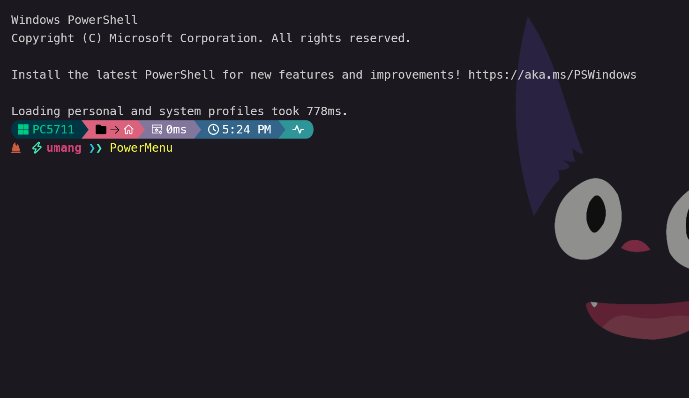
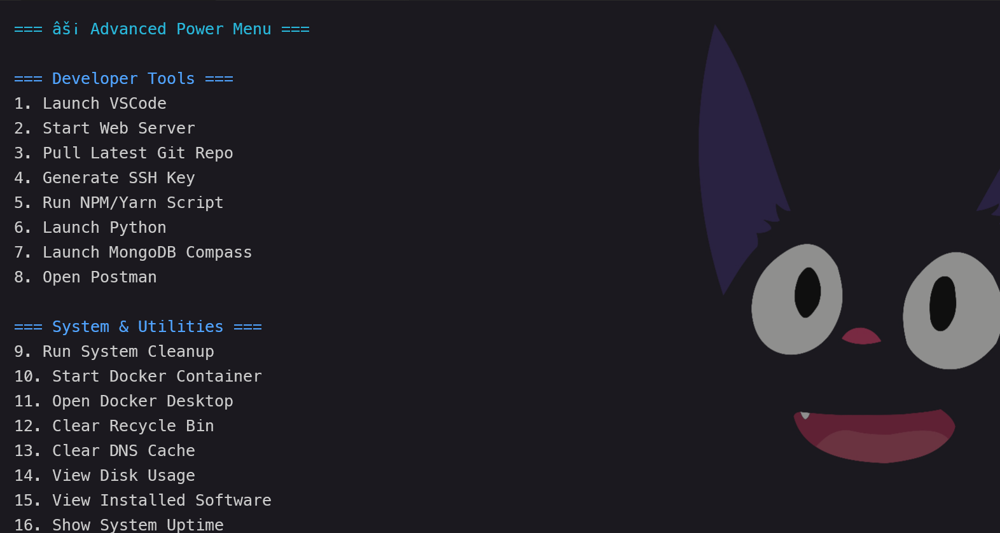
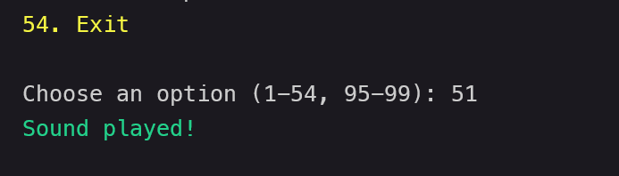
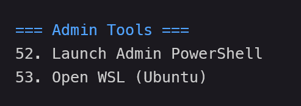
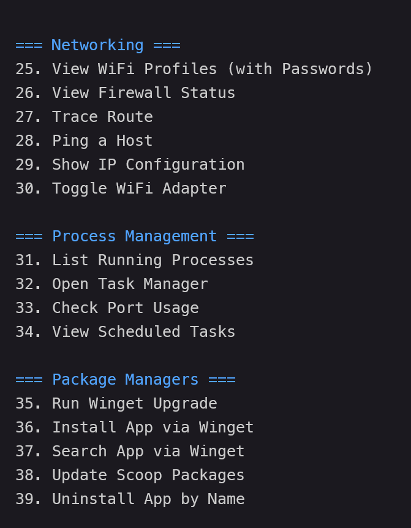
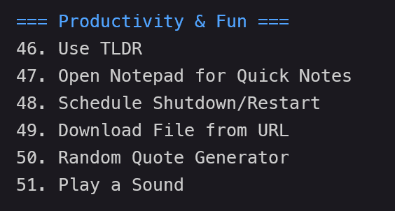
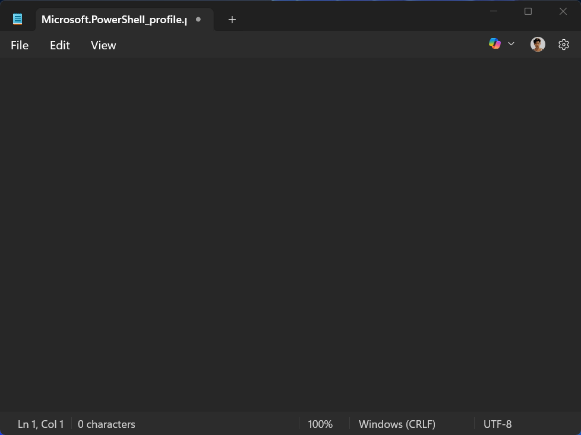

# ⚡ UG's Advanced Power Menu

<div align="center">
  
  <br>
  <em>An all-in-one, terminal-based productivity dashboard built with PowerShell</em>
</div>

Instantly launch developer tools, clean your system, manage processes, toggle Wi-Fi, open daily apps, and more — all from one sleek menu inside your terminal.

<div align="center">
  
  <br>
  <em>The intuitive menu interface makes navigation simple</em>
</div>

## 🚀 Key Features

### 👨‍💻 Developer Tools
<div align="right">
  
</div>

- Launch VSCode
- Start a local web server
- Pull the latest Git repository
- Generate SSH keys
- Run NPM/Yarn scripts
- Launch Python
- Open MongoDB Compass or Postman

<br clear="right"/>

### ⚙️ System & Utilities
<div align="right">
  
</div>

- Clean temporary files and the recycle bin
- Start Docker containers
- Flush DNS cache
- View disk usage, system uptime, and installed apps
- Edit PowerShell profile
- View and manage environment variables

<br clear="right"/>

### 🔐 Admin & Terminal Tools
<div align="right">
  
</div>

- Launch PowerShell as administrator
- Open WSL (Ubuntu)
- Manage system services
- Run scripts with elevated privileges
- Access system configuration

<br clear="right"/>

### 🌐 Networking Tools
<div align="right">
  
</div>

- View saved Wi-Fi profiles with passwords
- Check firewall status
- Run ping, trace route, and display IP info
- Enable or disable the Wi-Fi adapter
- View network configuration details

<br clear="right"/>

### 📂 File & Directory Tools
- Open the projects folder
- Use `fzf` for fuzzy file search
- Jump directories with `zoxide`
- Create quick backups
- Select and open recent projects using a fuzzy finder

### 🧠 Process & Task Management
- List running processes
- Open Task Manager
- Check for port usage
- View all scheduled tasks

### 📦 Package Manager Shortcuts
- Upgrade packages with `winget`
- Install, search, or uninstall apps via Winget
- Update Scoop packages

### 🌍 Apps & Web Shortcuts
- Open GitHub, Chrome, YouTube
- Launch Spotify, Discord, or Steam

### 🎯 Productivity & Fun
<div align="right">
  
</div>

- Use `tldr` for simplified help commands
- Open Notepad for quick notes
- Schedule a shutdown or restart
- Download files from a URL
- Display a random quote
- Play a sound

<br clear="right"/>

## 📦 Installation

Run this in **PowerShell 7+**:

```powershell
irm https://raw.githubusercontent.com/mini-page/PowerMenu/main/PowerMenu.ps1 | iex
```

> ✅ Make sure your execution policy allows it:
```powershell
Set-ExecutionPolicy RemoteSigned -Scope CurrentUser
```

## 📌 Optional: Make It Globally Accessible

To run `power-menu` from anywhere:

1. Save the script to a known location like:
   ```
   C:\Users\<YourUsername>\Scripts\power-menu.ps1
   ```

2. Add an alias to your PowerShell profile (`$PROFILE`):

- type Command (`notepad $PROFILE`)

>it will open your profile in notepad

   
   
   >copy this line and paste it on the notepad with your script location
   ```powershell
   Set-Alias power-menu "C:\Users\<YourUsername>\Scripts\power-menu.ps1"
   ```
   >like this
   

   - save it and reload/ restart your powershell... enjoy!

   ---


Now, just type `powermenu` in your terminal to launch it!

## 🛠 Requirements

- PowerShell 7+
- `fzf`, `zoxide` (optional but highly recommended)
- Installed apps like Docker, Postman, MongoDB Compass, etc. for full functionality

## 🧠 Inspiration

Designed to supercharge a developer's workflow with one-number access to common tasks. Inspired by Linux launchers, custom productivity scripts, and Oh My Posh enhancements.

## 🙌 Contributing

Fork the project and submit suggestions or pull requests. Contributions are always welcome!

## 💻 Author

Made with ❤️ by [mini-page](https://github.com/mini-page)
